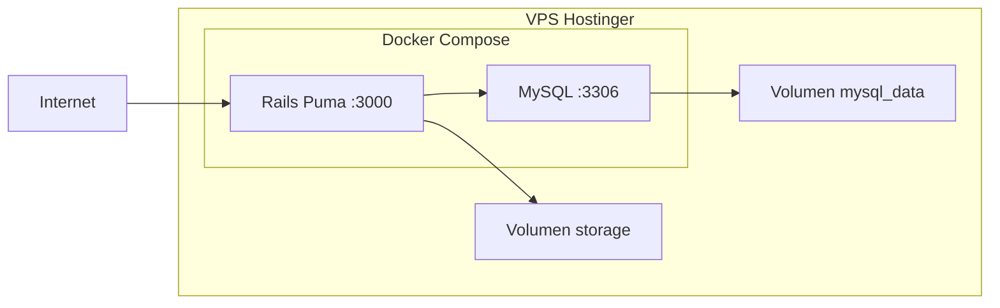

# Plan: Contenerizar Rails, probar en local (Colima/nerdctl) y desplegar en VPS

## Contexto del proyecto

- **App**: Rails 8, Ruby >= 3.3.6, Puma (ya en uso), producción con **MySQL** (gem `mysql2`, BD `db_thesitedj`).
- **Config actual**: [config/database.yml](config/database.yml) tiene credenciales de producción en texto; [config/storage.yml](config/storage.yml) usa disco local (`storage/`). No hay Docker en el repo.

---

## 1. Persistencia de la base de datos en contenedor

**Sí, es adecuado usar un contenedor para MySQL** y meter app + BD en un mismo `docker-compose`. Los datos **no se pierden** al detener contenedores o reiniciar el VPS si usas **volúmenes**:

- **Volumen nombrado** (recomendado): por ejemplo `mysql_data`. Docker guarda los datos en su directorio (p. ej. `/var/lib/docker/volumes/...`). Al hacer `docker compose down` y luego `up`, los datos siguen ahí.
- **Bind mount**: mapear un directorio del host (p. ej. `/home/usuario/app/mysql_data`) al directorio de datos de MySQL dentro del contenedor. Los datos viven en el VPS fuera del contenedor.

Mientras no borres el volumen ni el directorio montado, reinicios y `docker stop/start` no afectan los datos.

---

## 2. Mantener la app corriendo (Puma, sin Passenger)

En este esquema **no hace falta Passenger ni Unicorn** para “mantenerla corriendo”:

- El **proceso principal del contenedor** será **Puma** (`CMD` en el Dockerfile).
- Mientras el contenedor esté arriba, Puma sigue en ejecución.
- Con `docker compose` puedes usar `restart: unless-stopped` para que, si el contenedor falla o el VPS reinicia, el contenedor (y por tanto Puma) vuelva a levantarse.

Si más adelante quieres un reverse proxy (nginx) delante de Puma, se puede añadir otro servicio en el mismo Compose; para empezar, Puma escuchando en un puerto (p. ej. 3000) es suficiente.

---

## 3. Paso a paso: probar en local con Colima + nerdctl

### 3.1 Requisitos previos

- Colima instalado y levantado (`colima start`).
- nerdctl con namespace “default” (o el que uses): `nerdctl namespace list`.
- Cliente Docker Compose compatible: `nerdctl compose` (o `docker compose` si usas el contexto de Colima).

### 3.2 Archivos a crear en el repo

| Archivo                        | Propósito                                                                                                                    |
| ------------------------------ | ---------------------------------------------------------------------------------------------------------------------------- |
| `Dockerfile`                   | Imagen Rails: Ruby 3.3+, `bundle install`, precompilar assets en build, `CMD` con Puma.                                      |
| `docker-compose.yml`           | Servicios `web` (Rails) y `db` (MySQL). Volumen para datos MySQL y para `storage/` (Active Storage).                         |
| `.env.example`                 | Variables necesarias: `DATABASE_URL` o `MYSQL_*`, `SECRET_KEY_BASE`, `RAILS_ENV`, etc.                                       |
| `config/database.yml` (ajuste) | En producción, leer host/usuario/password/base de datos desde variables de entorno (no dejar credenciales fijas en el repo). |

### 3.3 Ajustes en la aplicación

- **database.yml**: En el bloque `production`, usar por ejemplo `host: ENV['MYSQL_HOST']`, `username: ENV['MYSQL_USER']`, `password: ENV['MYSQL_PASSWORD']`, `database: ENV['MYSQL_DATABASE']`, y quitar `socket` cuando se use red TCP (contenedor). En desarrollo/test seguir con SQLite si lo deseas.
- **No commitear** credenciales reales: usar `.env` (en `.gitignore`) y documentar en `.env.example`.
- **Storage**: En Compose, montar un volumen en `./storage` (o ruta equivalente en el contenedor) para que los archivos subidos persistan.

### 3.4 Orden de tareas para “probar en local”

1. **Levantar Colima**: `colima start`.
2. **Construir imagen**: desde la raíz del proyecto, `nerdctl compose build` (o `nerdctl build -t thesitedj .` y usar esa imagen en Compose).
3. **Crear `.env**` a partir de `.env.example` con valores de desarrollo/local (usuario/contraseña de MySQL, `SECRET_KEY_BASE`, etc.).
4. **Levantar solo MySQL** la primera vez: `nerdctl compose up -d db`.
5. **Restaurar el backup**: copiar el dump (por ejemplo `backup.sql`) al host y ejecutar algo como `nerdctl compose exec db mysql -u... -p... db_thesitedj < backup.sql` (o `cat backup.sql | nerdctl compose exec -T db mysql ...`). Alternativamente, montar el dump en un volumen y ejecutar un script de entrada en el contenedor (menos prioritario si harás restauración manual).
6. **Migraciones** (por si el backup no incluye el esquema o hay migraciones nuevas): `nerdctl compose run --rm web bin/rails db:migrate`.
7. **Levantar la app**: `nerdctl compose up -d web` (o `nerdctl compose up -d` para web + db).
8. **Probar**: abrir `http://localhost:3000` (o el puerto mapeado en `docker-compose.yml`). Verificar login, datos y subida de archivos (storage).

### 3.5 Comandos útiles

- Ver logs: `nerdctl compose logs -f web` (o `db`).
- Entrar al contenedor: `nerdctl compose exec web bash` (o `sh`).
- Parar: `nerdctl compose down` (los volúmenes se mantienen si están definidos en `docker-compose.yml`).

---

## 4. Automatizar despliegue en el VPS (Hostinger) por SSH

- **Objetivo**: Un script que, ejecutado desde tu máquina (o desde el propio VPS vía SSH), deje la app corriendo con Docker en el nuevo servidor.
- **Supuesto**: Tú haces el backup de MySQL manualmente desde el motor actual y restauras en el nuevo servidor (como indicaste); el script no hace el backup.

### 4.1 Contenido aproximado del script de despliegue

1. **Conectar por SSH** al VPS (usuario@ip o usuario@dominio).
2. **Comprobar/instalar Docker** (y Docker Compose v2 si no está): instalación según distro (apt/yum); añadir usuario al grupo `docker` si aplica.
3. **Crear directorio de la app** en el VPS (ej. `~/app` o `/var/www/thesitedj`).
4. **Subir archivos** necesarios: `Dockerfile`, `docker-compose.yml`, `.env` (generado o copiado con cuidado para no versionarlo), y el código de la app (por `rsync` o `scp`: `app/`, `config/`, `db/`, `lib/`, `public/`, `vendor/`, `Gemfile`, `Gemfile.lock`, `Rakefile`, `config.ru`, `bin/`, etc.). Excluir `log/`, `tmp/`, `node_modules`, `.git`, etc.
5. **En el VPS, vía SSH**:
  - `cd ~/app` (o la ruta elegida).
  - Si es la primera vez: crear `.env` con variables de producción (BD, `SECRET_KEY_BASE`, etc.).
  - `docker compose pull` si usas imagen remota, o `docker compose build --no-cache` si construyes en el servidor.
  - `docker compose up -d`.
6. **Restauración de BD**: Tú restauras el dump manualmente (como comentaste); el script puede dejar documentado el comando (ej. `docker compose exec -T db mysql -u... -p... db_thesitedj < backup.sql`) o un pequeño script `restore-db.sh` en el servidor que lea el dump de una ruta fija.
7. **Opcional**: Comprobar que el contenedor `web` responde (curl a `http://localhost:3000/up` o al puerto expuesto).

### 4.2 Cómo ejecutarlo

- Desde tu máquina: `./deploy.sh` (o `bash deploy.sh`) que internamente haga `ssh usuario@vps "..."` o use `rsync` + `ssh usuario@vps 'cd app && docker compose up -d'`.
- Alternativa: script que viva en el VPS y se invoque por SSH: `ssh usuario@vps '~/scripts/deploy.sh'`; ese script haría `git pull` (si usas git en el servidor), `docker compose build && docker compose up -d`, etc.

---

## 5. Resumen de archivos y cambios

- **Nuevos**: `Dockerfile`, `docker-compose.yml`, `.env.example`, script de despliegue (p. ej. `deploy.sh` o `scripts/deploy.sh`).
- **Modificar**: [config/database.yml](config/database.yml) para que production use solo variables de entorno (y conexión TCP a MySQL, sin socket).
- **No tocar** (por ahora): Unicorn/Passenger; en contenedor se usará solo Puma como proceso principal.

---

## 6. Diagrama de ejecución en producción (contenedores)

- **mysql_data**: persistencia de la BD; sobrevive a `down/up` y reinicios.
- **storage**: persistencia de Active Storage; sobrevive igual.
- **Puma**: proceso único del contenedor `web`; con `restart: unless-stopped` el stack se recupera solo tras reinicio del VPS.

Con esto tienes un plan detallado para: (1) contenerizar app + MySQL con datos persistentes, (2) probar en local con Colima/nerdctl, y (3) automatizar el despliegue en Hostinger por SSH, usando Puma como proceso estable dentro del contenedor y sin depender de Passenger.

---

## 7. Implementación realizada (progreso y cambios)

### 7.1 Archivos creados

| Archivo                   | Cambios realizados                                                                                                                                                                                                                                                                                                                                                                                                                                                                                                               |
| ------------------------- | -------------------------------------------------------------------------------------------------------------------------------------------------------------------------------------------------------------------------------------------------------------------------------------------------------------------------------------------------------------------------------------------------------------------------------------------------------------------------------------------------------------------------------- |
| **Dockerfile**            | Imagen `ruby:3.3.6-slim-bookworm`; instala build-essential, default-libmysqlclient-dev, pkg-config, libvips, curl; `bundle install` sin grupos development/test; precompilación de assets con `SECRET_KEY_BASE=dummy`; **docker-entrypoint.sh** ejecuta `rails db:migrate` en producción al arrancar y luego `exec` del CMD; **CMD** es `bundle exec puma -C config/puma.rb`; HEALTHCHECK con `curl http://localhost:3000/up`.                                                                                                   |
| **docker-compose.yml**    | Servicio **db**: imagen `mysql:8.0`, variables `MYSQL_ROOT_PASSWORD`, `MYSQL_DATABASE`, `MYSQL_USER`, `MYSQL_PASSWORD` desde `.env`; volumen `mysql_data`; healthcheck con `mysqladmin ping`; `restart: unless-stopped`. Servicio **web**: build desde `.`, `depends_on db` con `condition: service_healthy`; env `MYSQL_HOST=db`, resto desde `.env`; puerto `${PORT:-3000}:3000`; volumen `storage_data` en `/app/storage`; tmpfs en `/app/tmp`; `restart: unless-stopped`. Volúmenes nombrados `mysql_data` y `storage_data`. |
| **.env.example**          | Documenta `RAILS_ENV`, `MYSQL_HOST`, `MYSQL_USER`, `MYSQL_PASSWORD`, `MYSQL_DATABASE`, `MYSQL_ROOT_PASSWORD`, `SECRET_KEY_BASE`, `PORT`.                                                                                                                                                                                                                                                                                                                                                                                         |
| **.dockerignore**         | Excluye `.git`, `.cursor`, `log/*`, `tmp/*`, `storage/*`, `node_modules`, `.env`, `.env.*`, `*.sql`, etc., para builds más rápidos y seguros.                                                                                                                                                                                                                                                                                                                                                                                    |
| **docker-entrypoint.sh**  | Script que en `RAILS_ENV=production` ejecuta `bundle exec rails db:migrate` (idempotente) y luego `exec "$@"` (Puma).                                                                                                                                                                                                                                                                                                                                                                                                            |
| **deploy.sh**             | Script bash: requiere `DEPLOY_TARGET=usuario@host`; opcional `DEPLOY_PATH` (default `thesitedj`); rsync con exclusiones (`.git`, `log`, `tmp`, `storage`, `node_modules`, `.env`, `.cursor`, etc.); tras sincronizar ejecuta por SSH `docker compose build --no-cache && docker compose up -d` en el directorio de la app. Permisos de ejecución asignados.                                                                                                                                                                      |
| **scripts/restore-db.sh** | Script para restaurar dump MySQL en el contenedor: acepta `BACKUP_FILE=/ruta/backup.sql` o lectura desde stdin; carga `.env` si existe; usa `docker compose exec -T db mysql ...`. Pensado para ejecutarse en el VPS dentro del directorio de la app. Permisos de ejecución asignados.                                                                                                                                                                                                                                           |

### 7.2 Archivos modificados

| Archivo                 | Cambios realizados                                                                                                                                                                                                                                                                                                                                                         |
| ----------------------- | -------------------------------------------------------------------------------------------------------------------------------------------------------------------------------------------------------------------------------------------------------------------------------------------------------------------------------------------------------------------------- |
| **config/database.yml** | Bloque **production** reemplazado: ya no usa credenciales en texto ni `socket`. Ahora usa `host: ENV['MYSQL_HOST']` (default 127.0.0.1), `port: ENV['MYSQL_PORT']` (default 3306), `username: ENV['MYSQL_USER']`, `password: ENV['MYSQL_PASSWORD']`, `database: ENV['MYSQL_DATABASE']`, `pool: ENV['RAILS_MAX_THREADS']`. Conexión por TCP al contenedor o servidor MySQL. |
| **.gitignore**          | Añadidas entradas `.env`, `.env.local`, `.env.*.local` para no versionar secretos.                                                                                                                                                                                                                                                                                         |

### 7.3 Pasos para probar en local (Colima + nerdctl)

1. `colima start`
2. `cp .env.example .env` y editar `.env`: poner `SECRET_KEY_BASE` y los mismos `MYSQL_*` que en docker-compose.
3. `nerdctl compose build` (si cambias `db/schema.rb` o código, vuelve a hacer **build** para que la imagen lo incluya).
4. `nerdctl compose up -d` (levanta db y web; el db que queda es el único que usa el volumen de datos).
5. Para migraciones o seeds **sin crear otro contenedor de BD**, usa `--no-deps` para que use el db ya levantado:
  - `nerdctl compose run --rm --no-deps web bin/rails db:migrate`
  - `nerdctl compose run --rm --no-deps web bin/rails db:seed`
  - Para BD vacía desde cero: `nerdctl compose run --rm --no-deps web bin/rails db:drop db:create db:schema:load db:seed`
6. Abrir `http://localhost:3000` y verificar app y storage.

### 7.4 Pasos para desplegar en VPS (Hostinger)

1. En el VPS: instalar Docker y Docker Compose v2 si no están (script no los instala automáticamente).
2. Crear `.env` en el servidor (o copiarlo de forma segura); no subirlo por rsync (deploy.sh lo excluye).
3. Desde tu máquina: `DEPLOY_TARGET=usuario@tu-vps.com DEPLOY_PATH=thesitedj ./deploy.sh`.
4. Restaurar la BD en el servidor: subir `backup.sql` y en el VPS ejecutar `BACKUP_FILE=./backup.sql ./scripts/restore-db.sh` (o usar el comando `docker compose exec -T db mysql ...` documentado en el script).

### 7.5 Notas

- La aplicación se mantiene en ejecución con **Puma** como proceso único del contenedor `web`; no se usa Passenger ni Unicorn en este setup.
- Los datos de MySQL y los archivos de Active Storage persisten en volúmenes; `docker compose down` y reinicios del VPS no los borran.
- El entrypoint ejecuta migraciones al arrancar el contenedor `web`; para tareas one-off (migrate, seed) usar `**--no-deps**` para no levantar un segundo contenedor de BD: `nerdctl compose run --rm --no-deps web bin/rails db:migrate`.
- Si cambias `db/schema.rb` o el código de la app, hay que **reconstruir la imagen** (`nerdctl compose build web`) para que el contenedor use los cambios.

